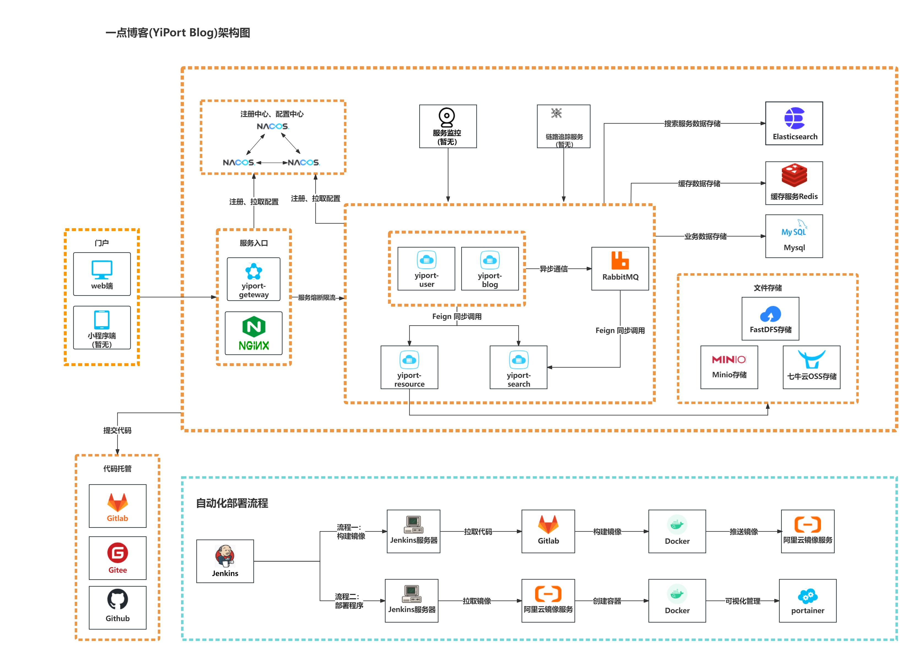

<p align="center">
  <h3 align="center">YiPortBlog</h3>
  <p align="center">
    🚀欢迎使用 YiPortBlog！
    <br/> 项目搭建中，快来和YiPort一起搭建博客吧！
    <br/>
    <br/>
    <a href="https://github.com/YiPort/yp_blog_frontend"><strong>博客前端项目 »</strong></a>
    <br/>
    <a href="https://github.com/YiPort/yp_blog/"><strong>博客后端项目 »</strong></a>
    <br/>
  </p>
<p align="center">
<a target="_blank" >
 
 
 </img>
 </img>
 </img>
 </img>
 </img>
 </img>
</img>
</a></p>

[项目介绍](#项目介绍) | [站点演示](#站点演示) | [项目特点](#项目特点) | [项目架构](#项目架构) | [项目目录](#项目目录) | [未来计划](#未来计划) | [快速开始](#快速开始) | [项目指南](#项目指南) | [环境搭建](#环境搭建) |

---

## 项目介绍
一点博客( YiPortBlog )，一个基于微服务架构的前后端分离博客系统。
Web 前端使用 Vue + ElementUi 。
后端使用 SpringCloud + SpringBoot + Mybatis-plus进行开发，使用 Jwt + SpringSecurity 做登录验证和权限校验，使用 ElasticSearch 作为文章检索服务，文件支持上传七牛云 、FastDFS 和 Minio 。

- 一点博客由小叶个人开发，由于现在还在实习，以及时间、精力和能力有限，所以大部分都是在下班时间抽空完成的，其中很多技术都是一边学习一边使用的，可以说一点博客也是一个我用来熟悉技术的项目，所以很多地方可能考虑不周，故有能改正的地方，还请各位大佬能够指出，不胜感激~
- 关于为什么要写这个项目，起因是这样的：一开始写博客用的是WordPress，在使用的时候就在想，我能不能也写一个博客出来，后来在一些机缘巧合下，我开始动手构建我的博客项目，不过一开始是单体项目，后来在写用户中心的时候，萌生了重构博客为微服务项目的想法，之后便有了这个项目。
- 目前一点博客已经基本完成2.x版本的功能，期间学习了大量优秀的项目，收获不少，接下来小叶有新的目标，要开始新征程，这个项目也将随着小叶个人的成长不定期更新，欢迎大佬一起建设一点博客！


## 站点演示

**项目站点：** [YiPortBlog](http://blog.yiport.top)

**GitHub地址：** [https://github.com/YiPort/yp_blog](https://github.com/YiPort/yp_blog)

## 项目特点
- 编写博客采用 Markdown 编辑器，易上手
- 采用 Minio 或 FastDFS 搭建对象存储服务，同时引入七牛云对象存储
- 采用 AOP + 自定义注解 + Redis 实现日志管理，自定义配置限流
- 采用 JWT 的方式进行用户鉴权，配合网关服务保证其他所有微服务都能准确识别用户身份
- 采用 Nacos 作为服务发现和配置中心，支持分布式集群架构，方便微服务配置管理，轻松完成项目的配置的维护
- 采用 Getaway 搭建网关服务，进行负载转发的同时对用户身份进行识别
- 采用 Maven 插件实现自动化构建 Docker 镜像 , 配合 Docker Compose 完成容器编排，Portainer 实现容器可视化
- 代码支持多种搜索模式（使用 Elasticsearch 全文检索服务 或 使用 MYSQL 进行标题搜索）
- 为解决多个子系统内代码大量重复的问题，抽象模型层和业务层代码为公共模块
- 采用 Restful 风格的 API，注释完善，代码遵循阿里巴巴开发规范，便于阅读及二次开发，有利于开发者学习


## 项目架构




## 项目目录

SQL文件位于根目录下 [sql](./sql) 文件夹下面

```
├─yiport-blog                    -- 主体微服务
│   ├── yiport-blog-service      -- 主体服务功能模块
│   └── yiport-blog-client       -- 客户端服务模块
├─yiport-framework               -- 公用框架服务
│   ├── yiport-framework-common  -- 公用框架基础模块
│   ├── yiport-framework-utils   -- 公用框架工具模块
│   └── yiport-framework-web     -- 公用框架web模块
├─yiport-user                    -- 用户管理微服务
│   ├── yiport-user-service      -- 用户服务功能模块
│   └── yiport-user-client       -- 用户服务客户端服务模块
├─yiport-search                  -- 搜索微服务
│   ├── yiport-search-service    -- 搜索服务功能模块
│   └── yiport-search-client     -- 搜索客户端服务模块
├─yiport-resource                -- 资源管理微服务
│   ├── yiport-resource-service  -- 资源服务功能模块
│   └── yiport-resource-client   -- 资源服务客户端服务模块
└── yiport-gateway               -- 网关微服务
```


## 未来计划

目前一点博客已经完成了大部分的博客该有的功能了，现在将开发计划公开，希望能有参与者参与贡献。


|                   新功能或新模块                    |  难度  |
|:--------------------------------------------:| :----: |
|               对原来的模块进行完善及新增功能                | 看情况 |
|                     邮件功能                     |  简单  |
|                    消息通知模块                    |  中等  |
|                  较为完善的系统监控                   |  中等  |
|              使用页面静态化技术对博客详情页静态化              |  中等  |
|                     社区模块                     |  困难  |
| 增加博客迁移功能，让其它平台的博客，如：CSDN、WordPress能够同步到一点博客中 |  困难  |

目前一点博客已经完成了大部分的博客该有的功能了，现在将开发计划公开，希望能有参与者参与贡献。

已完成的计划

|          新功能或新模块          |  完成情况  |
|:-------------------------:| :----: |
|         访问记录（IP）          | &#10004; |
|          评论敏感词过滤          | &#10004; |
|        管理员管理评论和文章         | &#10004; |
|          简单的系统监控          | &#10004; |
| 发送邮件、通过邮件系统登录、获取用户名以及修改密码 |  &#10004;  |

## 快速开始

1. 请查看[项目部署指南](./doc/DeploymentGuide/README.md)，进行环境安装，以及其他操作。
2. 配合[项目配置文件文档](./doc/InterfaceDocument/README.md)进行安装

## 项目指南

### 项目指南导航
[项目指南导航](./doc/README.md)


#### 项目接口文档
[项目接口文档](./doc/InterfaceDocument/README.md)


### 运行环境
**服务器环境：** 

（操作系统：CentOS7.6）

- java 1.8+
- node.js 16+


## 环境搭建

### 后端开发环境

|      技术       |    说明     |                            官网                             |
|:-------------:|:---------:|:---------------------------------------------------------:|
|  SpringBoot   |   MVC框架   |          https://spring.io/projects/spring-boot           |
|  SpringCloud  |   微服务框架   |         https://spring.io/projects/spring-cloud/          |
|    Gateway    |  网关服务框架   |      https://spring.io/projects/spring-cloud-gateway      |
|     Fegin     |   RPC框架   |     https://spring.io/projects/spring-cloud-openfeign     |
|     Nacos     |  注册、配置中心  |                  https://nacos.io/zh-cn/                  |
| MyBatis-Plus  |   数据库框架   |                 https://mp.baomidou.com/                  |
|     MySQL     |    数据库    |                  https://www.mysql.com/                   |
|     Redis     |   分布式缓存   |                     https://redis.io/                     |
|   RabbitMQ    |   消息队列    |                 https://www.rabbitmq.com/                 |
| Elasticsearch |   搜索引擎    |         https://github.com/elastic/elasticsearch          |
|    Docker     |   容器化部署   |                  https://www.docker.com/                  |
|    Jenkins    |  自动化部署服务  |                  https://www.jenkins.io/                  |
|     Druid     |  数据库连接池   |             https://github.com/alibaba/druid              |
|      七牛云      |    七牛云    |       https://developer.qiniu.com/sdk#official-sdk        |
|     SLF4J     |   日志框架    |                   http://www.slf4j.org/                   |
|    Lombok     | 简化对象封装工具  |          https://github.com/rzwitserloot/lombok           |
|     Nginx     |  web服务器   |                     http://nginx.org/                     |
|    Hutool     | Java工具包类库 |                 https://hutool.cn/docs/#/                 |
|    FastDFS    | 分布式对象存储服务 |       https://github.com/happyfish100/fastdfs             |
|     Minio     | 分布式对象存储服务 |                      https://min.io/                      |

### 前端开发环境

#### 前端运行
**1、安装node.js**
参考菜鸟教程：https://www.runoob.com/nodejs/nodejs-install-setup.html

**2、运行前端项目**
```shell

# 进入到前端项目目录
# 强烈建议不要用直接使用 cnpm 安装，会有各种诡异的 bug，可以通过重新指定 registry 来解决 npm 安装速度慢的问题。
npm install --registry=https://registry.npmmirror.com

# 本地开发 启动项目
npm run dev
 
```
打开浏览器输入
http://localhost:8080/

### 开发工具

|         工具          |       说明        |                          官网                          |
|:-------------------:| :---------------: |:----------------------------------------------------:|
|        IDEA         |    Java开发IDE    |       https://www.jetbrains.com/idea/download        |
| Visual Studio Code  |    前端开发IDE    |            https://code.visualstudio.com/            |
| RedisDesktopManager |  Redis可视化工具  | https://github.com/RedisInsight/RedisDesktopManager/ |
|     SwitchHosts     |   本地Host管理    |         https://oldj.github.io/SwitchHosts/          |
|       X-shell       | Linux远程连接工具 |           https://xshell.en.softonic.com/            |
|        X-ftp        | Linux文件传输工具 |     https://www.netsarang.com/zh/all-downloads/      |
|       SQLyog        |  数据库连接工具   |           https://sqlyog.en.softonic.com/            |
