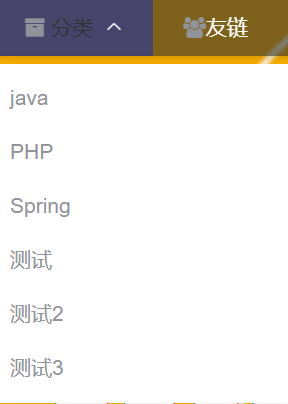

# 博客主体服务接口文档

[返回目录](./README.md)

## 1. 热门文章列表

### 1.1 需求

> 需要查询浏览量最高的前10篇文章的信息。要求展示文章标题和浏览量。把能让用户自己点击跳转到具体的文章详情进行浏览。
>
>注意：不能把草稿展示出来，不能把删除了的文章查询出来。要按照浏览量进行降序排序。

### 1.2 接口设计

| 请求方式 | 请求路径                    | 请求头     |
|------|-------------------------|---------|
| Get  | /article/hotArticleList | 需要token |

#### 响应格式：

~~~~json
{
  "code": 200,
  "data": [
    {
      "id": "1",
      "title": "test",
      "viewCount": "1"
    },
    {
      "id": "2",
      "title": "测试",
      "viewCount": "1"
    }
  ],
  "msg": "操作成功"
}
~~~~

查询分类列表

## 2. 查询分类列表

#### 2.1 需求

> 页面上需要展示分类列表，用户可以点击具体的分类查看该分类下的文章列表。
>
>注意： ①要求只展示有发布正式文章的分类 ②必须是正常状态的分类

#### 2.2 接口设计

| 请求方式 | 请求路径                      | 请求头      |
|------|---------------------------|----------|
| Get  | /category/getCategoryList | 不需要token |

#### 响应格式：

~~~~json
{
  "code": 200,
  "data": [
    {
      "description": "yiport-test",
      "id": "1",
      "name": "java",
      "pid": "-1"
    },
    {
      "description": "yiport-test",
      "id": "2",
      "name": "PHP",
      "pid": "-1"
    }
  ],
  "msg": "操作成功"
}
~~~~

## 3. 分页查询文章列表

### 3.1 需求

> 在首页和分类页面都需要查询文章列表。
>
> 首页：查询所有的文章
>
> 分类页面：查询对应分类下的文章
>
>要求：①只能查询正式发布的文章 ②置顶的文章要显示在最前面

### 3.2 接口设计

| 请求方式 | 请求路径                 | 请求头     |
|------|----------------------|---------|
| Get  | /article/articleList | 需要token |

**Query格式请求参数：**

- articleId:文章id
- pageNum: 页码
- pageSize: 每页条数

> 当categoryId为0时，根据分类查询的条件失效

#### 响应格式：

~~~~json
{
  "code": 200,
  "data": {
    "rows": [
      {
        "categoryName": "java",
        "createTime": "2023-01-01 00:07:43",
        "id": "1",
        "summary": "简述1",
        "thumbnail": "https://imageurl",
        "title": "标题1",
        "viewCount": "1"
      },
      {
        "categoryName": "PHP",
        "createTime": "2022-01-21 14:58:30",
        "id": "2",
        "summary": "简述2",
        "thumbnail": "https:/imagesurl2",
        "title": "标题2",
        "viewCount": "0"
      }
    ],
    "total": "7"
  },
  "msg": "操作成功"
}
~~~~

## 4. 文章详情接口

### 4.1 需求

> 要求在文章列表点击阅读全文时能够跳转到文章详情页面，可以让用户阅读文章正文。
> - 要求：①要在文章详情中展示其分类名

### 4.2 接口设计

| 请求方式 | 请求路径          | 请求头      |
|------|---------------|----------|
| Get  | /article/{id} | 不需要token |

#### 响应格式：

~~~~json
{
  "code": 200,
  "data": {
    "categoryId": "1",
    "categoryName": "java",
    "content": "内容",
    "createTime": "2022-01-23 23:20:11",
    "id": "1",
    "isComment": "0",
    "title": "SpringSecurity从入门到精通",
    "viewCount": "114"
  },
  "msg": "操作成功"
}
~~~~

## 5. 查询友链列表

### 5.1 需求

> 在友链页面要查询出所有的审核通过的友链。

### 5.2 接口设计

| 请求方式 | 请求路径             | 请求头      |
|------|------------------|----------|
| Get  | /link/getAllLink | 不需要token |

#### 响应格式：

~~~~json
{
  "code": 200,
  "data": [
    {
      "address": "https://www.baidu.com",
      "description": "sda",
      "id": "1",
      "logo": "图片url1",
      "name": "sda"
    },
    {
      "address": "https://www.qq.com",
      "description": "dada",
      "id": "2",
      "logo": "图片url2",
      "name": "sda"
    }
  ],
  "msg": "操作成功"
}
~~~~

## 6. 查询评论列表

### 6.1 需求

> 文章详情页面要展示这篇文章下的评论列表。

### 6.2 接口设计

| 请求方式 | 请求地址                 | 请求头         |
|------|----------------------|-------------|
| GET  | /comment/commentList | 不需要token请求头 |

#### Query格式请求参数

- articleId:文章id
- pageNum: 页码
- pageSize: 每页条数

~~~~json
{
  "code": 200,
  "data": {
    "rows": [
      {
        "articleId": "1",
        "children": [
          {
            "articleId": "1",
            "content": "子评论1",
            "createBy": "1",
            "createNick": "yiport",
            "createTime": "2023-04-26 10:06:21",
            "id": "20",
            "rootId": "1",
            "status": "0",
            "toCommentId": "1",
            "toCommentUserId": "1"
          },
          {
            "articleId": "1",
            "content": "子评论12",
            "createBy": "1",
            "createNick": "yiport",
            "createTime": "2023-04-26 17:19:30",
            "id": "27",
            "rootId": "1",
            "status": "0",
            "toCommentId": "20",
            "toCommentUserId": "1"
          }
        ],
        "content": "父评论1",
        "createBy": "1",
        "createNick": "yiport",
        "createTime": "2023-04-25 07:59:22",
        "id": "1",
        "rootId": "-1",
        "status": "0",
        "toCommentId": "-1",
        "toCommentUserId": "-1"
      },
      {
        "articleId": "1",
        "children": [],
        "content": "父评论2",
        "createBy": "1",
        "createNick": "yiport",
        "createTime": "2023-04-25 08:01:24",
        "id": "2",
        "rootId": "-1",
        "status": "0",
        "toCommentId": "-1",
        "toCommentUserId": "-1"
      }
    ],
    "total": "4"
  },
  "msg": "操作成功"
}
~~~~

## 7. 发表评论接口

### 7.1 需求

> 用户登录后可以对文章发表评论，也可以对评论进行回复。
>
>用户登录后也可以在友链页面进行评论。

### 7.2 接口设计

| 请求方式 | 请求地址     | 请求头      |
|------|----------|----------|
| POST | /comment | 需要token头 |

#### 请求体：

**回复了文章**

~~~~json
{
  "articleId": 1,
  "type": 0,
  "rootId": -1,
  "toCommentId": -1,
  "toCommentUserId": -1,
  "content": "评论了文章"
}
~~~~

**回复了某条评论**

~~~~json
{
  "articleId": 1,
  "type": 0,
  "rootId": "3",
  "toCommentId": "3",
  "toCommentUserId": "1",
  "content": "回复了某条评论"
}
~~~~

> 如果是友链评论，type应该为1

#### 响应格式：

~~~~java
{
        "code":200,
        "msg":"操作成功"
        }
~~~~

## 8.友联评论列表

### 8.1 需求

> 友链页面也需要查询对应的评论列表。

### 8.2 接口设计

| 请求方式 | 请求地址                     | 请求头         |
|------|--------------------------|-------------|
| GET  | /comment/linkCommentList | 不需要token请求头 |

#### Query格式请求参数

- pageNum: 页码
- pageSize: 每页条数

#### 响应格式

~~~~json
{
  "code": 200,
  "data": {
    "rows": [
      {
        "articleId": "1",
        "children": [
          {
            "articleId": "1",
            "content": "回复友链评论1",
            "createBy": "1",
            "createTime": "2022-01-30 10:08:50",
            "id": "23",
            "rootId": "22",
            "toCommentId": "22",
            "toCommentUserId": "1",
            "toCommentUserName": "sg333",
            "username": "yiport"
          }
        ],
        "content": "友链评论2",
        "createBy": "1",
        "createTime": "2022-01-30 10:08:28",
        "id": "22",
        "rootId": "-1",
        "toCommentId": "-1",
        "toCommentUserId": "-1",
        "username": "yiport"
      }
    ],
    "total": "1"
  },
  "msg": "操作成功"
}
~~~~

