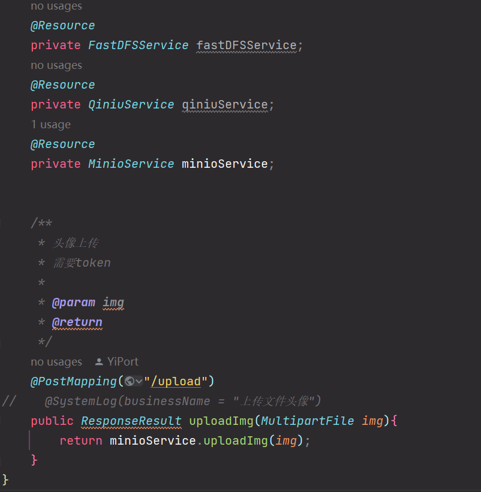

# 资源模块接口文档

[返回目录](./README.md)

## 1.头像上传接口

### 1.1 需求

> 在个人中心点击编辑的时候可以上传头像图片。上传完头像后，可以用于更新个人信息接口。

### 1.2 选型

#### 1.2.1 为什么要使用OSS

因为如果把图片视频等文件上传到自己的应用的Web服务器，在读取图片的时候会占用比较多的资源。影响应用服务器的性能。
所以我们一般使用OSS(Object Storage Service对象存储服务)存储图片或视频。

#### 1.2.2 如果不选择OSS，为何选择FastDFS和Minio？

1.出于成本考虑，FastDFS和Minio是开源且免费的,无需付费使用，而七牛云需要按照使用流量和容量收费。
2.灵活的控制能力，FastDFS和Minio可以部署在自己的服务器上,完全掌控所有资源,不依赖外部服务商。
3.支持分布式，FastDFS和Minio支持很好的水平扩展,按需增减服务器实现无限扩展。
> 推荐使用Minio ， 原因是FastDFS的安装较为繁琐。

#### 1.2.3 补充说明

> 本项目支持七牛云OSS、FastDFS、Minio作为文件删除功能
>
>

### 1.3 接口设计

| 请求方式 | 请求地址             | 请求头     |
|------|------------------|---------|
| POST | /resource/upload | 需要token |

#### 参数：

img,值为要上传的文件

#### 请求头

Content-Type ：multipart/form-data;

#### 响应格式:

~~~~json
{
  "code": 200,
  "data": "文件访问链接",
  "msg": "操作成功"
}
~~~~
